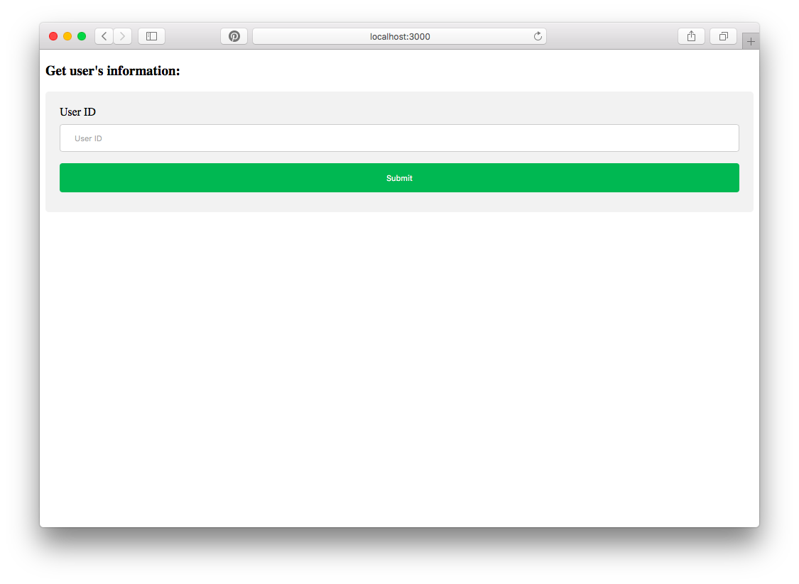
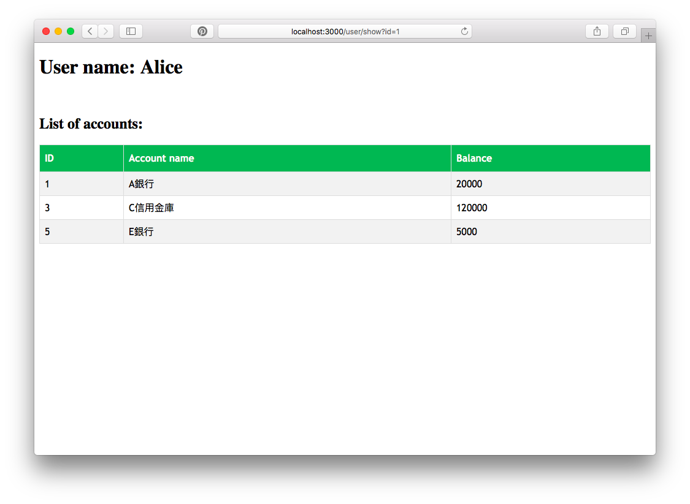

# README

**Account list app by Ruby**

* Home screen:

* Detail screen


**Things you may want to cover:**

* Ruby version 2.5.3
[Install ruby on rail](https://gorails.com/setup/osx/10.13-high-sierra)


* How to run 


- Terminal move to folder
```
$ cd ios-coding-challenge-316
```
- Setup bundle
```
$ bundle install
```
- Start server
```
$ rails server
```
- Open browser:
```
http://localhost:3000
```

* Requirement
[お題 / Coding Challenge](https://sample-accounts-api.herokuapp.com)
